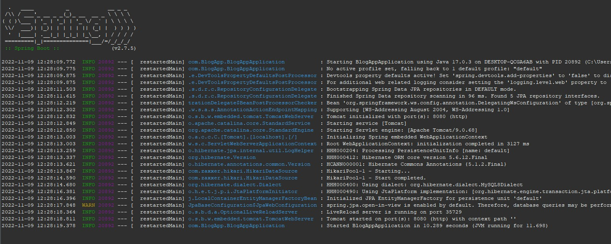
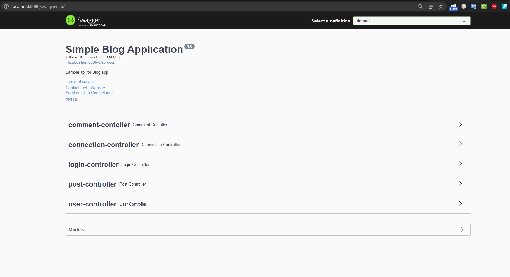

# blog-api


This is a springboot project which can genarate REST API for blog. 

#### You can,
#
1. Create a User account.
2. Update your account details.
3. Login to your account.
4. Search for a friend by his/her name.
5. Follow / Unfollow a friend.
6. Create a blog post.
7. Delete a post.
8. Add comments on posts.
9. Edit comments.
10. Delete your comments.

#### How to use?

As this is a rest API project, client part hasn't added to it. But you can use Swagger or Postman to play with the API. And also you can use this API with your frontend project. As it will be on localServer on your PC you need to keep the server on while playing with it. Steps given below for additional info,
#
```
1. CREATE database blogApp;
```
#
Create a database on your local system. If you don't have MySQL installed, kindly install it first. 
- [Install](https://dev.mysql.com/doc/refman/8.0/en/macos-installation.html) - On Mac
- [Install](https://dev.mysql.com/doc/refman/8.0/en/windows-installation.html) - On Windows
- [Install](https://dev.mysql.com/doc/mysql-shell/8.0/en/mysql-shell-install-linux-quick.html) - On Linux
#
Once Installed please set/keep your mysql credentials as below 
#

```
username: root
password: root
```
#
and create the database as mentioned above. Database name-> blogApp;
#

```
2. git clone https://github.com/starving-array/blog-api.git;
```
#
Clone this repo to your local system and open STS to import and run the project. 
If you don,t have STS IDE on your system, kindly download [STS](https://spring.io/tools).
#

```
3. Open STS and Import the Project;
```
#
File -> Open Projects from File Systems -> Directory
- Browse to the location where you have cloned this project. And select  _blog-api_ 
#
Next-> Finish. _It might take a few minutes to download all the dependencies on your local system. You can check the progress bar at righ-down corner._  
#
Once finished update the Maven project to make sure all the dependencies have downloaded.
#
Right Click on _blog_api_ at package exporer on leftside window, 
Maven -> Update Project -> check Force Update on SnapShots/releases -> Ok
#

 _Congratulation, you've successfully imported the project on your system_

#

```
4. Start the Spring Boot App Server;
``` 

#
Right Click on _blog_api_ at package exporer on leftside window, 
Run as -> Spring Boot App
#

_You can see the process as a console window will be opening below._

#



```
5. http://localhost:8080/swagger-ui/;
``` 
#

Open this [link](http://localhost:8080/swagger-ui/) on broswer. It will open the Swagger UI. You can play with All the API there. 

#


#
```
6. STOP the server;
```

#
Once you are done with playing, click on the red square box on top of the console to stop the server.
#

#### Important Facts,
1. _The port for this application has set 8080. You can change it from Application Properties in resource folder, or stop any other running app before starting this as it can create conflict for same port that you might be using coincedently._

#
```
#changing the server port
server.port=8080
```
#

2. _Incase if have different root name and password for mysql in your system, you change this application username and password from Application Properties.

#
```
# MySql username and Password
spring.datasource.username=root
spring.datasource.password=root
```

#
### API names and Use=> ###

#
```sh
**UUID used as security param to authenticate user and maintain security.
```
#

#### 1. User-controller:
- createAccountH :  _Create a new account._
- updateAccountH : _Modify your account_
- searchUserByNameH : _Search for a friend by name._
- followUser : _Follow a User_
- unFollowUser: _Unfollow a User_

#
##### 1.1 LOGIN: 
- logInUser : _Login with Contact No and Password. This will genarate a UUID to control activity and it will also maintain security._
- logoutUser : _Session will be deleted, (UUID) once you have logged out._
- getAccountDetails : _With UUID and account id as parameters, it will match if the user is same and return user detail._
 
#
#### 2.Connection:
- getFollowing : _With userId param of user A this will return a list of Users, user A is following._
- getFollower : _With userId param of user A this will return a List of Users, who follows user A._

#
#### 3.Post:
- createPostH : _Create a new post._ 
- updatePostH : _Modify post._
- getAllPostH : _Get all post from database._
- getPostById : _Get a post by id param._
- deletetePostH : _Delete a post._
- getPostByPage : _Pagination. By default the post per page has been set to 10. And by passing the pageno as param, this will return List of post for that page._
- getTotalPostSize : _Return total post count._

#
#### 4.Comment:
- createNewCommentH : _Create a new comment on a post._  
- updateCommentH : _Modify comment._
- getAllCommentByPost : _Get a List of comments for a post._
- getCommentById : _Get a comment by id._
- deleteCommentH : _Delete a comment._


#
```
PostRating, Sorting, And Tags will be updated soon.  
```
